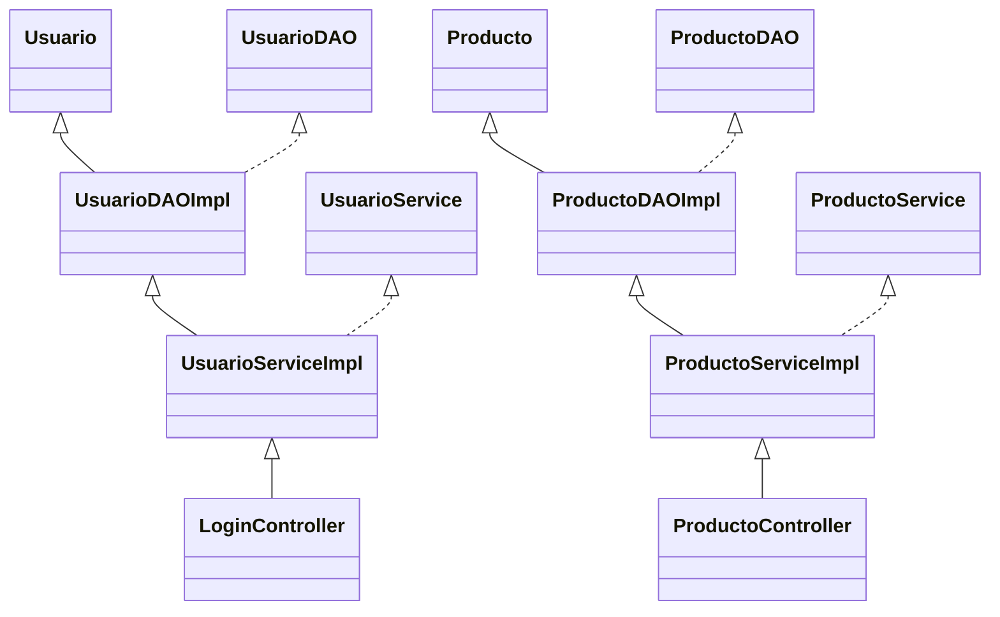

# Sistema de Gestión de Productos - Spring Boot MVC

## 1. Uso de Docker Compose para la Base de Datos

Incluye un archivo `docker-compose.yml` para levantar los servicios necesarios:

```yaml
db:
  image: mysql:8.0
  container_name: mysql_modulo5
  restart: always
  environment:
    MYSQL_ROOT_PASSWORD: root
    MYSQL_DATABASE: tienda_online
    MYSQL_USER: Modulo5
    MYSQL_PASSWORD: modulo5
  ports:
    - "3307:3306"
  volumes:
    - ./mysql_data:/var/lib/mysql

phpmyadmin:
  image: phpmyadmin/phpmyadmin
  restart: always
  ports:
    - "8080:80"
  environment:
    PMA_HOST: db
    PMA_PORT: 3306
  depends_on:
    - db
```

- **MySQL**: Puerto 3307
- **phpMyAdmin**: Puerto 8080

Para iniciar los servicios:
```bash
docker-compose up -d
```

## 2. Usuario y Contraseña para la Base de Datos

- Utiliza el script src/main/resources/database/crear_usuario.sql
- **Usuario**: Modulo5
- **Contraseña**: modulo5
- Este usuario tiene permisos para crear la base de datos y operar sobre ella.
- Utiliza el script src/main/resources/database/crear_bd.sql o el mysql-notebook

## 3. Configuración en `application.properties`

```properties
spring.datasource.url=jdbc:mysql://localhost:3307/tienda_online?useSSL=false&serverTimezone=UTC&allowPublicKeyRetrieval=true
spring.datasource.username=Modulo5
spring.datasource.password=modulo5
spring.datasource.driver-class-name=com.mysql.cj.jdbc.Driver

spring.jpa.hibernate.ddl-auto=none
spring.jpa.show-sql=true
spring.jpa.properties.hibernate.format_sql=true
spring.jpa.properties.hibernate.dialect=org.hibernate.dialect.MySQLDialect

spring.mvc.view.prefix=/WEB-INF/views/
spring.mvc.view.suffix=.jsp

server.port=8081
```
- Puedes modificar el puerto `server.port` según disponibilidad.
- Cambia usuario y clave si usas otro administrador MySQL.

## 4. Nombre, Características y Columnas de la Base de Datos

**Base de datos:** `tienda_online`

### Tabla: `usuarios`
| Columna         | Tipo         | Descripción                |
|-----------------|--------------|----------------------------|
| id              | INT          | PK, autoincremental        |
| username        | VARCHAR(50)  | Usuario único              |
| password        | VARCHAR(100) | Contraseña                 |
| nombre_completo | VARCHAR(100) | Nombre completo            |
| email           | VARCHAR(100) | Email                      |
| activo          | BOOLEAN      | Estado de usuario          |
| fecha_registro  | TIMESTAMP    | Fecha de registro          |

### Tabla: `productos`
| Columna           | Tipo         | Descripción                |
|-------------------|--------------|----------------------------|
| id                | INT          | PK, autoincremental        |
| nombre            | VARCHAR(100) | Nombre del producto        |
| descripcion       | TEXT         | Descripción                |
| precio            | DECIMAL(10,2)| Precio                     |
| stock             | INT          | Stock disponible           |
| categoria         | VARCHAR(50)  | Categoría                  |
| activo            | BOOLEAN      | Estado del producto        |
| fecha_creacion    | TIMESTAMP    | Fecha de creación          |
| fecha_modificacion| TIMESTAMP    | Fecha de última modificación|

## 5. Patrón MVC

- **Modelo**: Entidades JPA (`Usuario`, `Producto`)
- **Vista**: JSP (`/WEB-INF/views/`)
- **Controlador**: Clases en `controller` (`LoginController`, `ProductoController`)

## 6. Patrón DAO

- **Interfaces**: `UsuarioDAO`, `ProductoDAO`
- **Implementaciones**: `UsuarioDAOImpl`, `ProductoDAOImpl`
- **Servicios**: `UsuarioService`, `ProductoService`

## 7. Diagrama de Jerarquía de Archivos

```
producto-mvc/
├── src/
│   ├── main/
│   │   ├── java/com/skillnest/producto_mvc/
│   │   │   ├── controller/
│   │   │   ├── dao/
│   │   │   ├── dao/impl/
│   │   │   ├── model/
│   │   │   ├── service/
│   │   │   ├── service/impl/
│   │   │   ├── ProductoMvcApplication.java
│   │   ├── resources/
│   │   │   ├── application.properties
│   │   │   └── database/
│   │   │       ├── crear_bd.sql
│   │   │       └── crear_usuario.sql
│   │   ├── webapp/WEB-INF/views/
│   │   │   ├── login.jsp
│   │   │   ├── dashboard.jsp
│   │   │   └── productos/
│   │   │       ├── lista.jsp
│   │   │       ├── formulario.jsp
│   │   │       └── detalle.jsp
├── pom.xml
├── docker-compose.yml
```

## 8. Diagrama UML (Simplificado)



## 9. Instrucciones para Compilar y Correr el Proyecto

1. Instala dependencias y compila:
```bash
mvn clean compile
```
2. Ejecuta la aplicación:
```bash
mvn spring-boot:run
```
3. Accede en el navegador:
```
http://localhost:8081
```

---

**Notas:**
- Modifica puertos en `application.properties` y `docker-compose.yml` según tu entorno.
- Usa phpMyAdmin en `http://localhost:8080` para administrar la base de datos visualmente.
- El usuario `Modulo5` con clave `modulo5` tiene todos los permisos necesarios.
