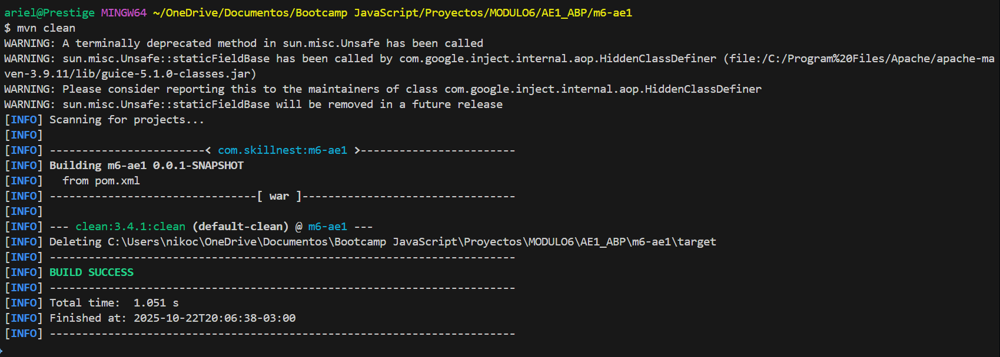
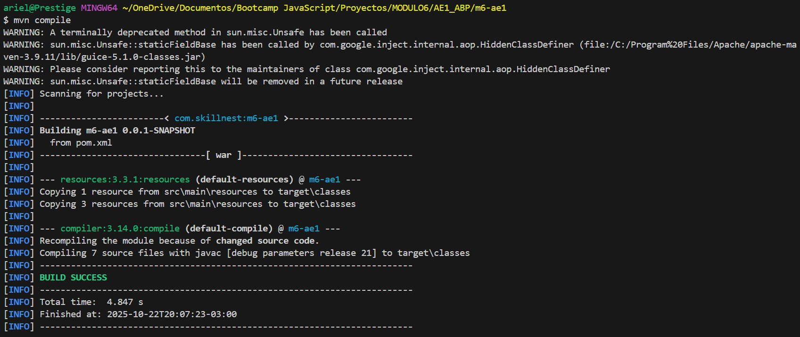
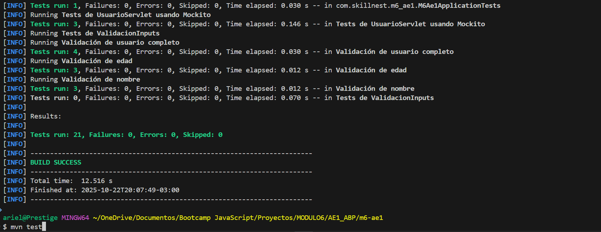
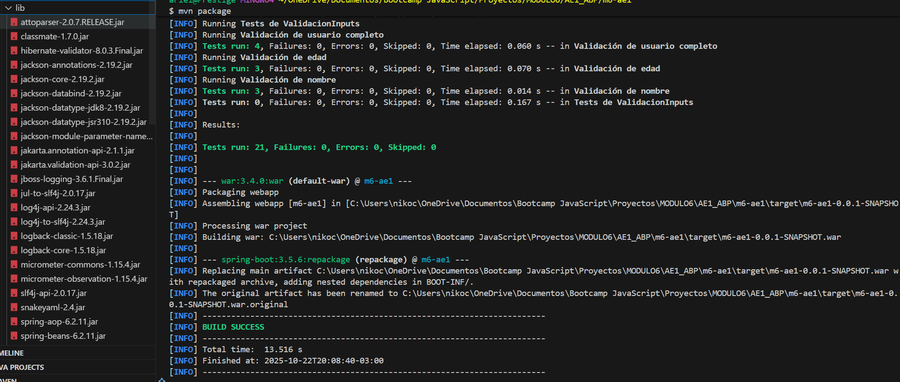
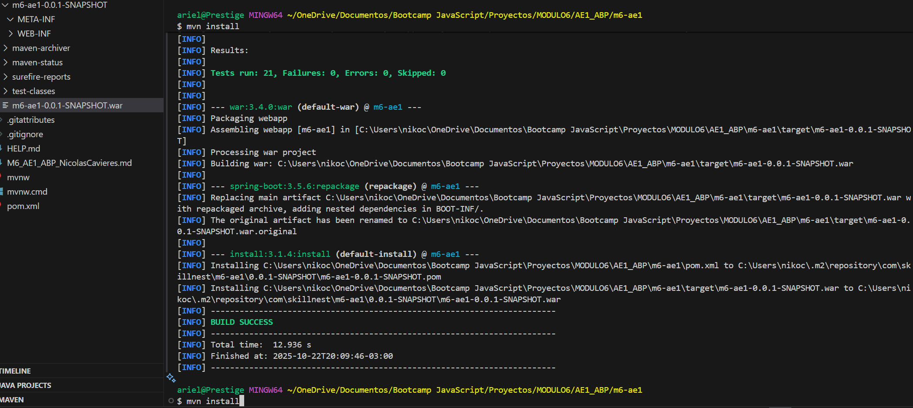
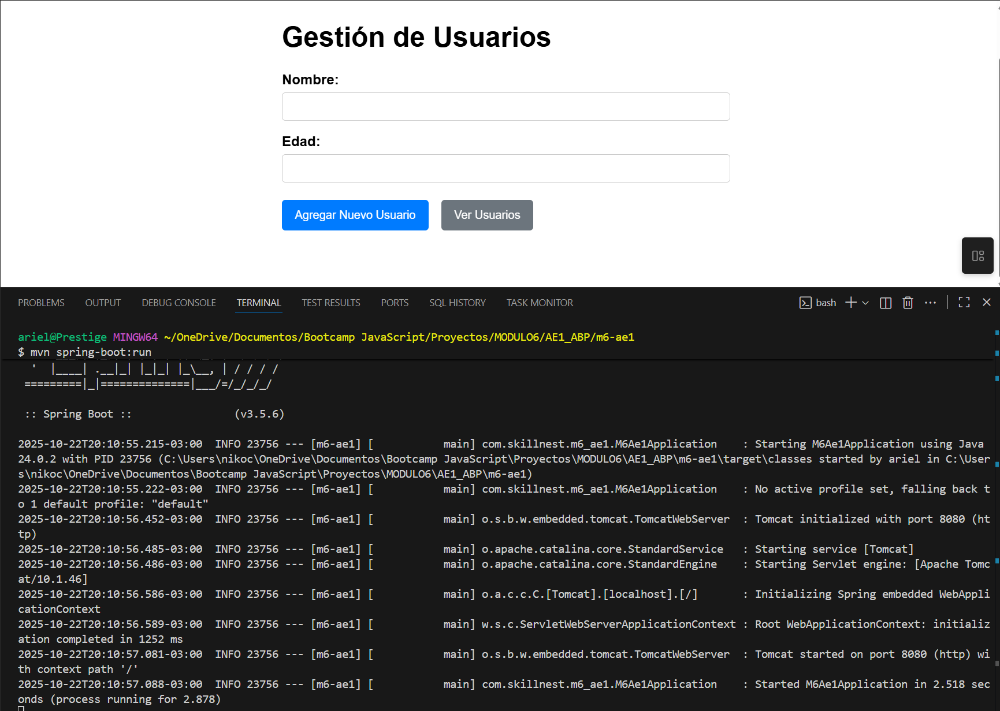

# Ejercicio grupal: Desarrollo y Compilación

## Contexto de la actividad

Como parte de un equipo de desarrollo, se nos solicitó construir la estructura base de un proyecto Java, asegurando buena configuración, gestión de dependencias, pruebas iniciales, empaquetamiento y ejecución funcional. El proceso fue documentado y justificado para su presentación al equipo.

---

## Paso 1: Creación del proyecto base con Maven y Spring Boot

**Elección:** Se optó por Spring Boot, que incluye un patrón de diseño MVC como parte de su stack web. Spring Boot simplifica la configuración, incluye Tomcat embebido, gestiona dependencias automáticamente y permite un desarrollo más ágil y productivo. El proyecto utiliza tanto Spring Boot (para la configuración y arranque) como Spring MVC (para el manejo de controladores web y peticiones HTTP).

**Patrón arquitectónico utilizado: MVC (Modelo-Vista-Controlador)**
El proyecto implementa MVC en:
- **Modelo:** La clase `Usuario.java` representa los datos y la validación.
- **Vista:** La clase `FormUsuario.java` y las plantillas Thymeleaf (`form.html`, `usuarios.html`, `resultado.html`) muestran la interfaz al usuario.
- **Controlador:** Se utiliza un controlador Spring (`AgregarUsuarioCommand`) para recibir y procesar las solicitudes, gestionar la lógica y actualizar el modelo/vista.
Esta estructura permite separar claramente la lógica de negocio, la presentación y el manejo de las solicitudes, siguiendo buenas prácticas de desarrollo web.

**Configuración del pom.xml:**
- groupId: `com.skillnest`
- artifactId: `m6-ae1`
- version: `0.0.1-SNAPSHOT`
- packaging: `war`
- Dependencias principales:
  - `spring-boot-starter-web`: Para construir aplicaciones web y APIs REST.
  - `spring-boot-starter-thymeleaf`: Motor de plantillas para renderizado en servidor.
  - `spring-boot-starter-validation`: Validación de datos con Jakarta Validation/Hibernate Validator.
  - `spring-boot-starter-test`: Pruebas unitarias con JUnit 5.

---

## Paso 2: Ciclo de vida y comandos Maven

Se ejecutaron los siguientes comandos y se documentó su efecto, incluyendo capturas de pantalla del proceso:

### `mvn clean`
Elimina la carpeta `target/` y todos los artefactos compilados. Prepara el proyecto para una compilación limpia.

### `mvn compile`
Compila el código fuente en `src/main/java` y genera los `.class` en `target/classes/`.

### `mvn test`
Compila y ejecuta las pruebas unitarias desde `src/test/java`.

### `mvn package`
Empaqueta el proyecto en un archivo WAR en `target/`.

Archivos y carpetas creados:
- `target/m6-ae1-0.0.1-SNAPSHOT.war` (archivo WAR)
- `target/m6-ae1-0.0.1-SNAPSHOT/` (estructura del WAR)
- `target/classes/` (clases compiladas)
- `target/test-classes/` (clases de test)
- `target/surefire-reports/` (reportes de test)

### `mvn install`
Instala el paquete en el repositorio local de Maven para reutilización.

Archivos creados en el repositorio local:
- `<usuario>/.m2/repository/com/skillnest/m6-ae1/0.0.1-SNAPSHOT/m6-ae1-0.0.1-SNAPSHOT.war`
- `<usuario>/.m2/repository/com/skillnest/m6-ae1/0.0.1-SNAPSHOT/m6-ae1-0.0.1-SNAPSHOT.pom`

### `mvn spring-boot:run`
Ejecuta la aplicación Spring Boot y muestra el programa corriendo en el navegador.

---

## Paso 3: Formulario con validación básica

Se creó un formulario HTML usando Thymeleaf para capturar nombre y edad. El formulario envía los datos a un Servlet (`UsuarioServlet`) que valida:
- Que el nombre no esté vacío
- Que la edad sea un número válido y positivo

La validación se realiza tanto en el modelo (`Usuario.java` con anotaciones de Jakarta Validation) como manualmente en el Servlet. Si los datos son válidos, se almacenan en memoria usando `ServletContext` y se muestran en una tabla.

---

## Paso 4: Manejo de dependencias y estructura

**Descarga de dependencias:** Maven descarga automáticamente las dependencias declaradas en `pom.xml` desde el repositorio central a la carpeta local (`C:\Users\<usuario>\.m2\repository`).

**Repositorio local:** Contiene archivos `.jar`, `.pom` y sumas de verificación para cada dependencia, organizados por grupo, artefacto y versión.

**Estructura generada por Maven:**
- `src/main/java`: Código fuente principal
- `src/main/resources`: Recursos (plantillas, configuración)
- `src/test/java`: Pruebas unitarias
- `target/`: Archivos compilados y empaquetados

---

## Paso 5: Documentación y presentación

**Configuración en pom.xml:**
- Se incluyeron dependencias clave para web, plantillas, validación y pruebas.
- Se configuró el empaquetado como WAR para despliegue flexible.

**Validaciones:**
- Se usan anotaciones de Jakarta Validation en el modelo y validación centralizada en el controlador y servlet.
- El formulario muestra retroalimentación usando Thymeleaf.
- Se creo una clase auxiliar `ValudacionInputs` que es simple, para que nos devuelva mensajes y podamos saber cual fue el error del usuario.

**Errores y soluciones:**
- Se eliminaron redundancias en la validación y el manejo dse la lista de usuario.
- Se corrigieron los tests unitarios para evitar errores de Mockito (`UnnecessaryStubbingException`).
- Se migró la lógica principal a un patrón de diseño MVC para mayor claridad y mantenibilidad. Por ejemplo, `AgregarUsuarioCommand` se podría utilizar como base para crear otras acciones como `EliminarUsuarioCommand` o `ModificarUsuarioCommand`

**Aprendizajes sobre Maven y arquitectura:**
- Cada comando tiene un rol específico en el ciclo de vida.
- La gestión automática de dependencias y el repositorio local facilitan el desarrollo.
- La estructura generada por Maven ayuda a mantener el orden y la escalabilidad del proyecto.
- Priorizar una arquitectura consistente y simple mejora la mantenibilidad y la calidad del código.