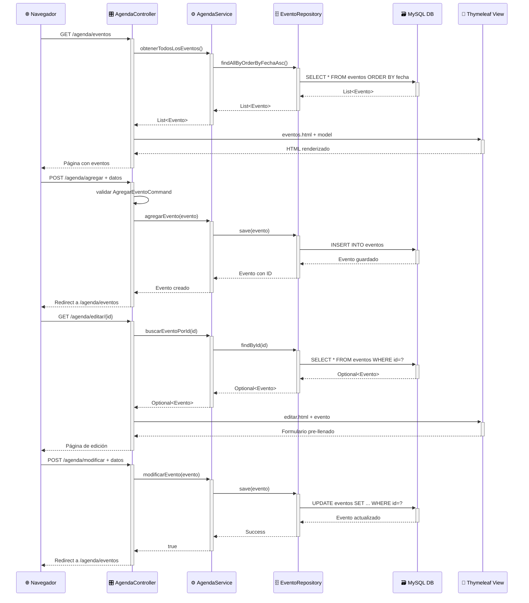

# Mini Agenda Compartida

## 1. Tecnologías necesarias para compilar
- Java 21+
- Maven 3.6+
- Docker y Docker Compose (para base de datos MySQL y phpMyAdmin)

## 2. Instrucciones para levantar el programa

### Levantar la base de datos (MySQL + phpMyAdmin)
```bash
docker-compose up -d
```
- MySQL: puerto 3307
- phpMyAdmin: puerto 8081 (opcional, para visualizar la base de datos)

### Ejecutar la aplicación Spring Boot
```bash
# Desde la raíz del proyecto
./mvnw spring-boot:run
```

- Accede a la aplicación en: [http://localhost:8090/agenda](http://localhost:8090/agenda)
- Verifica la escritura de la base de datos en: [http://localhost:8081/](http://localhost:8081/)

## 3. Jerarquía de archivos principal

```
miniagenda/
├── src/
│   ├── main/
│   │   ├── java/com/skillnest/miniagenda/
│   │   │   ├── config/                    # Configuración Spring
│   │   │   │   └── DataInitializer.java   # Inicialización de datos
│   │   │   ├── controller/                # Controladores MVC
│   │   │   │   ├── AgendaController.java
│   │   │   │   └── command/               # Command Objects (DTOs)
│   │   │   │       ├── AgregarEventoCommand.java
│   │   │   │       ├── ModificarEventoCommand.java
│   │   │   │       └── EliminarEventoCommand.java
│   │   │   ├── model/                     # Entidades JPA
│   │   │   │   └── Evento.java            # Entidad mapeada a tabla MySQL
│   │   │   ├── repository/                # Repositorios JPA
│   │   │   │   └── EventoRepository.java  # Interface Spring Data JPA
│   │   │   ├── service/                   # Lógica de negocio
│   │   │   │   ├── AgendaService.java     # Interface del servicio
│   │   │   │   └── AgendaServiceImpl.java # Implementación con JPA
│   │   │   ├── MiniagendaApplication.java # Clase principal Spring Boot
│   │   │   └── ServletInitializer.java    # Configuración WAR
│   │   └── resources/
│   │       ├── application.properties     # Config DB MySQL + Hibernate
│   │       └── templates/                 # Vistas Thymeleaf + Bootstrap
│   │           ├── eventos.html           # Lista de eventos (Grid)
│   │           ├── formulario.html        # Crear nuevo evento
│   │           └── editar.html            # Editar evento existente
│   └── test/
│       └── java/                          # Pruebas unitarias JUnit
├── compose.yaml                           # Docker: MySQL + phpMyAdmin
├── init.sql                               # Script inicialización base datos
├── pom.xml                                # Dependencias Maven + JPA/MySQL
└── README.md                              # Documentación del proyecto
```

## 4. Tecnologías y frameworks utilizados
- **Spring Boot 3.5.7:** Framework principal con auto-configuración
- **Spring MVC:** Patrón Model-View-Controller para la web
- **Spring Data JPA:** Persistencia de datos con Hibernate
- **Thymeleaf:** Motor de plantillas para las vistas HTML
- **Bootstrap 5:** Framework CSS para diseño responsive
- **MySQL 8.0:** Base de datos relacional
- **Maven:** Gestión de dependencias y construcción
- **Docker Compose:** Contenedores para MySQL y phpMyAdmin

## 5. Patrones de diseño utilizados
- **MVC (Model-View-Controller):**
  - Separación de responsabilidades entre modelo, vistas y controladores.
- **Repository Pattern:**
  - Abstracción de acceso a datos con `EventoRepository` usando Spring Data JPA.
- **Command Object:**
  - Uso de objetos DTO para encapsular datos y validaciones de formularios (`AgregarEventoCommand`, `ModificarEventoCommand`).
- **Dependency Injection:**
  - Inyección de dependencias con `@Autowired` para desacoplamiento.

## 6. Comandos Maven útiles

- Compilar el proyecto:
  ```bash
  ./mvnw clean compile
  ```
- Ejecutar la aplicación:
  ```bash
  ./mvnw spring-boot:run
  ```
- Ejecutar pruebas:
  ```bash
  ./mvnw test
  ```
- Empaquetar (WAR):
  ```bash
  ./mvnw clean package
  ```
- Debug (añadir `-Dspring-boot.run.fork=false` para debug en IDE):
  ```bash
  ./mvnw spring-boot:run -Dspring-boot.run.fork=false
  ```

## 7. Diagrama de Arquitectura UML

### 7.1 Diagrama de Clases y Componentes

```mermaid
classDiagram
    %% Capa de Presentación (HTML Views)
    class EventosHTML {
        +mostrarEventos()
        +renderizarTarjetas()
        +manejarInteracciones()
    }
    
    class FormularioHTML {
        +mostrarFormulario()
        +validarCampos()
        +enviarDatos()
    }
    
    class EditarHTML {
        +cargarDatosEvento()
        +mostrarFormularioEdicion()
        +actualizarEvento()
    }

    %% Capa de Control
    class AgendaController {
        -agendaService : AgendaService
        +mostrarEventos() : String
        +mostrarFormulario() : String
        +agregarEvento(comando) : String
        +mostrarFormularioEdicion(id) : String
        +modificarEvento(comando) : String
        +eliminarEvento(id) : String
    }

    %% Command Objects (DTOs)
    class AgregarEventoCommand {
        -titulo : String
        -fecha : LocalDate
        -descripcion : String
        -responsable : String
        +validaciones()
    }
    
    class ModificarEventoCommand {
        -id : Long
        -titulo : String
        -fecha : LocalDate
        -descripcion : String
        -responsable : String
        +validaciones()
    }
    
    class EliminarEventoCommand {
        -id : Long
    }

    %% Capa de Servicio
    class AgendaService {
        <<interface>>
        +agregarEvento(evento) : Evento
        +obtenerTodosLosEventos() : List~Evento~
        +buscarEventoPorId(id) : Optional~Evento~
        +modificarEvento(evento) : boolean
        +eliminarEvento(id) : boolean
        +obtenerEventosAgrupadosPorFecha() : Map
    }
    
    class AgendaServiceImpl {
        -eventoRepository : EventoRepository
        +agregarEvento(evento) : Evento
        +obtenerTodosLosEventos() : List~Evento~
        +buscarEventoPorId(id) : Optional~Evento~
        +modificarEvento(evento) : boolean
        +eliminarEvento(id) : boolean
        +obtenerEventosAgrupadosPorFecha() : Map
    }

    %% Capa de Repositorio
    class EventoRepository {
        <<interface>>
        +findByFecha(fecha) : List~Evento~
        +findByResponsable(responsable) : List~Evento~
        +findAllByOrderByFechaAsc() : List~Evento~
        +save(evento) : Evento
        +findById(id) : Optional~Evento~
        +deleteById(id) : void
    }

    %% Modelo de Datos
    class Evento {
        -id : Long
        -titulo : String
        -fecha : LocalDate
        -descripcion : String
        -responsable : String
        +getId() : Long
        +setId(id) : void
        +getTitulo() : String
        +setTitulo(titulo) : void
        +getFecha() : LocalDate
        +setFecha(fecha) : void
        +getDescripcion() : String
        +setDescripcion(descripcion) : void
        +getResponsable() : String
        +setResponsable(responsable) : void
    }

    %% Base de Datos
    class MySQL_DB {
        +tabla_eventos
        +operaciones_CRUD()
    }
    
    class DataInitializer {
        -eventoRepository : EventoRepository
        +run(args) : void
        +inicializarDatosEjemplo()
    }

    %% Relaciones
    EventosHTML -.-> AgendaController : HTTP GET /agenda/eventos
    FormularioHTML -.-> AgendaController : HTTP POST /agenda/agregar
    EditarHTML -.-> AgendaController : HTTP POST /agenda/modificar
    
    AgendaController --> AgendaService : inyección dependencia
    AgendaController --> AgregarEventoCommand : usa
    AgendaController --> ModificarEventoCommand : usa
    AgendaController --> EliminarEventoCommand : usa
    
    AgendaService <|.. AgendaServiceImpl : implementa
    AgendaServiceImpl --> EventoRepository : inyección dependencia
    AgendaServiceImpl --> Evento : manipula
    
    EventoRepository --> MySQL_DB : JPA/Hibernate
    EventoRepository --> Evento : mapea entidad
    
    DataInitializer --> EventoRepository : inicializa datos
    DataInitializer --> Evento : crea instancias

    %% Anotaciones Spring
    note for AgendaController "@Controller\n@RequestMapping"
    note for AgendaServiceImpl "@Service"
    note for EventoRepository "@Repository\nJpaRepository"
    note for Evento "@Entity\n@Table"
    note for DataInitializer "@Component\nCommandLineRunner"
```

### 7.2 Flujo de Datos y Interacciones



### 7.3 Arquitectura por Capas

```
┌─────────────────────────────────────────────────────────────┐
│                    🌐 CAPA DE PRESENTACIÓN                   │
│  ┌─────────────────┐ ┌─────────────────┐ ┌─────────────────┐ │
│  │   eventos.html  │ │ formulario.html │ │   editar.html   │ │
│  │   (Thymeleaf +  │ │   (Thymeleaf +  │ │   (Thymeleaf +  │ │
│  │   Bootstrap 5)  │ │   Bootstrap 5)  │ │   Bootstrap 5)  │ │
│  └─────────────────┘ └─────────────────┘ └─────────────────┘ │
└─────────────────────────────────────────────────────────────┘
                               │ HTTP (GET/POST)
┌─────────────────────────────────────────────────────────────┐
│                     🎛️ CAPA DE CONTROL                      │
│  ┌─────────────────────────────────────────────────────────┐ │
│  │              AgendaController                           │ │
│  │  @Controller, @RequestMapping                          │ │
│  │  - Maneja requests HTTP                                │ │
│  │  - Valida Command Objects                              │ │
│  │  - Coordina Service Layer                              │ │
│  └─────────────────────────────────────────────────────────┘ │
└─────────────────────────────────────────────────────────────┘
                               │ Inyección de Dependencias
┌─────────────────────────────────────────────────────────────┐
│                    ⚙️ CAPA DE SERVICIO                      │
│  ┌─────────────────────────────────────────────────────────┐ │
│  │         AgendaService + AgendaServiceImpl               │ │
│  │  @Service                                              │ │
│  │  - Lógica de negocio                                  │ │
│  │  - Transacciones                                       │ │
│  │  - Orchestación de repositorios                       │ │
│  └─────────────────────────────────────────────────────────┘ │
└─────────────────────────────────────────────────────────────┘
                               │ Inyección de Dependencias
┌─────────────────────────────────────────────────────────────┐
│                 🗄️ CAPA DE REPOSITORIO                     │
│  ┌─────────────────────────────────────────────────────────┐ │
│  │              EventoRepository                           │ │
│  │  @Repository, extends JpaRepository                    │ │
│  │  - Abstracción de acceso a datos                      │ │
│  │  - Query methods automáticos                          │ │
│  │  - Operaciones CRUD                                   │ │
│  └─────────────────────────────────────────────────────────┘ │
└─────────────────────────────────────────────────────────────┘
                               │ JPA/Hibernate
┌─────────────────────────────────────────────────────────────┐
│                   🗃️ CAPA DE PERSISTENCIA                  │
│  ┌─────────────────────────────────────────────────────────┐ │
│  │                   MySQL Database                       │ │
│  │  - Tabla: eventos                                     │ │
│  │  - Campos: id, titulo, fecha, descripcion, responsable│ │
│  │  - Constraints, Indexes                               │ │
│  └─────────────────────────────────────────────────────────┘ │
└─────────────────────────────────────────────────────────────┘
```
