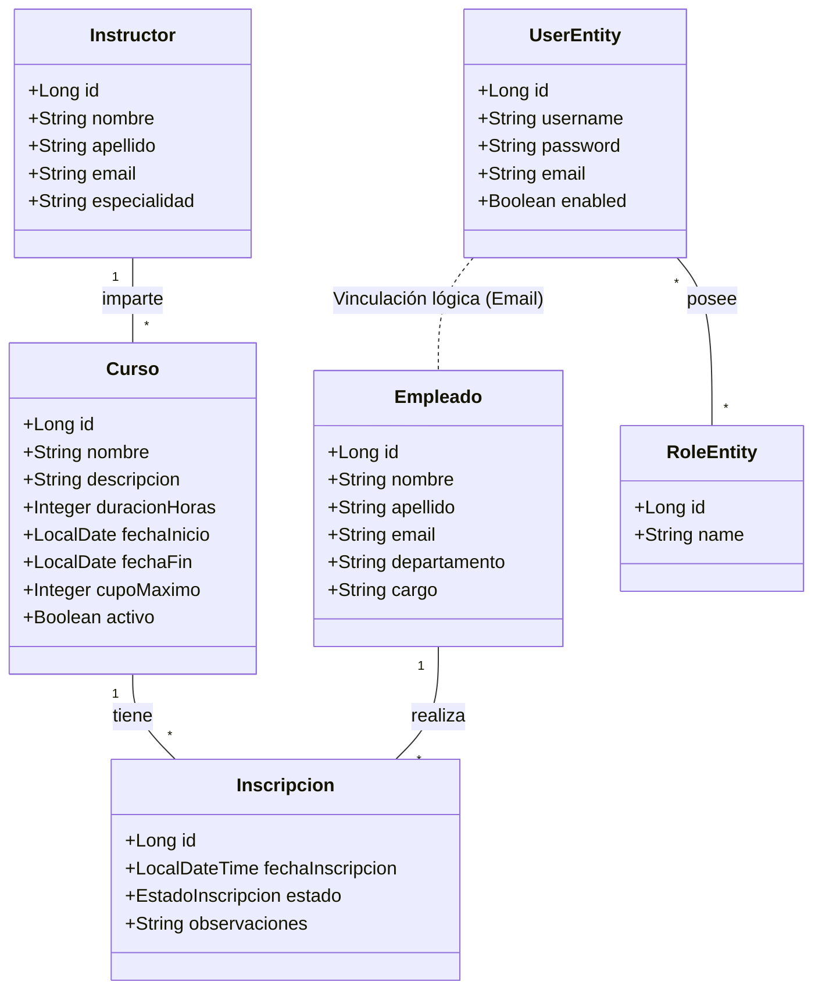
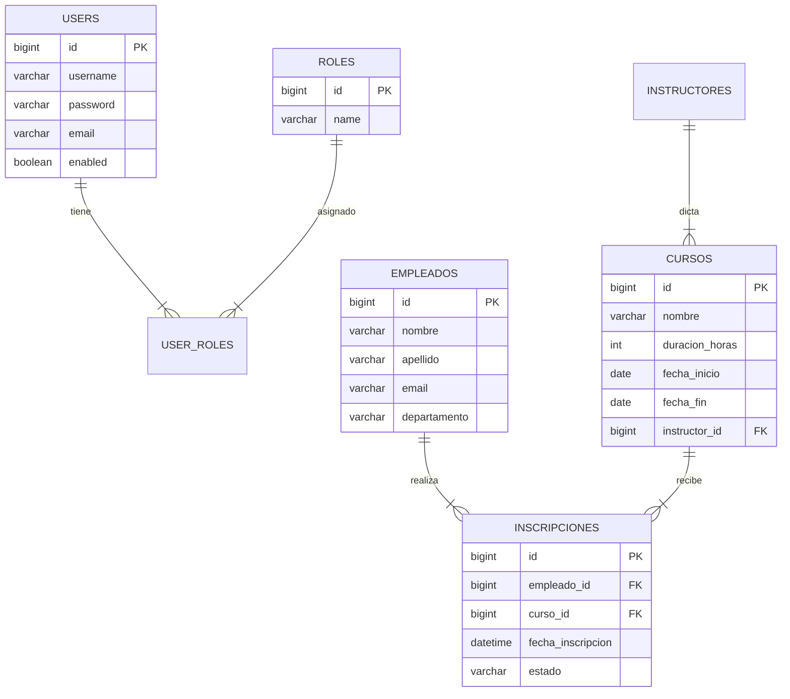
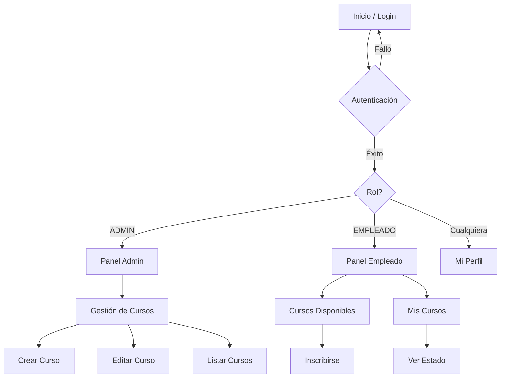
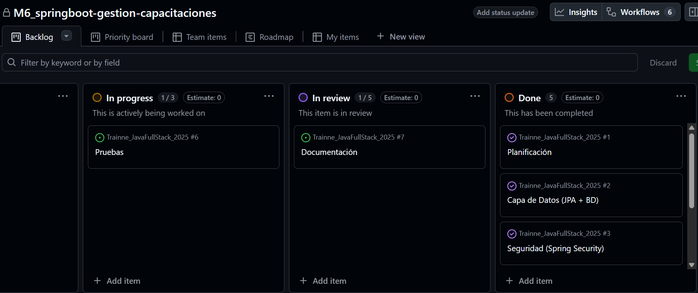

# 📘 Sistema de Gestión de Capacitaciones - SkillNest

## 📋 Descripción del Proyecto
Este proyecto es una aplicación web desarrollada con **Spring Boot** para la gestión de capacitaciones en una empresa. Permite administrar cursos, instructores y empleados, así como gestionar las inscripciones a los cursos disponibles. El sistema cuenta con autenticación y autorización basada en roles (Administrador y Empleado).

---

## 🏗️ Arquitectura del Sistema

### 1. Diagrama de Clases
El siguiente diagrama muestra la estructura de clases del dominio principal y seguridad:



### 2. Diagrama de Base de Datos (ERD)
Estructura relacional de la base de datos MySQL:



---

## 🔄 Flujo de Navegación

### Diagrama de Flujo de Usuario
El sistema dirige a los usuarios a diferentes vistas según su rol:



---

## 📸 Gestión del Proyecto
Evidencia del uso de herramientas de gestión de proyectos (Trello/Jira/Kanban):

### Tablero de Tareas


### Detalle de Historias de Usuario


---

## 🚀 Instrucciones de Ejecución
Revisar IniciarProyecto.md

### Requisitos
- Java 21+
- Maven
- MySQL 8.0+

### Pasos Rápidos
1. **Configurar Base de Datos**:
   Asegúrate de tener MySQL corriendo en el puerto configurado (`TuPuertoMysql`) y crea la base de datos:
   ```bash
   mysql -u TuUsuario -p < src/main/resources/static/crear_base_datos.sql
   ```

2. **Ejecutar Aplicación**:
   ```bash
   mvn spring-boot:run
   ```

3. **Acceder**:
   - Abre: `http://localhost:TuPuerto`
   - **Admin**: `admin` / `admin123`
   - **Empleado**: `empleado1` / `empleado123`

---
**Desarrollado para el Módulo 6 - Bootcamp Java Full Stack**
